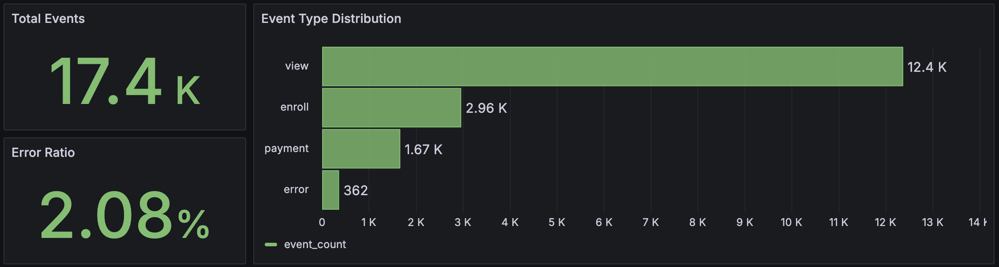
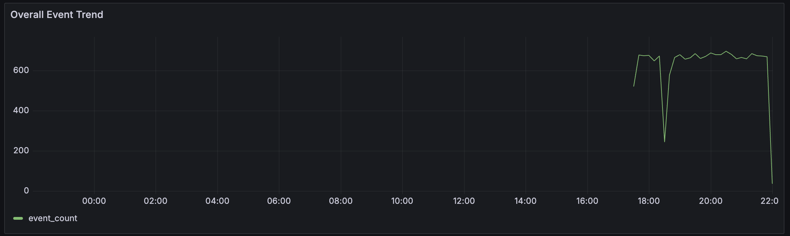
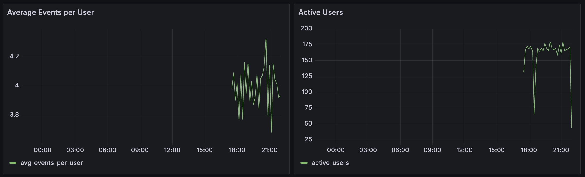
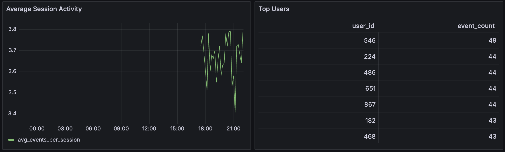
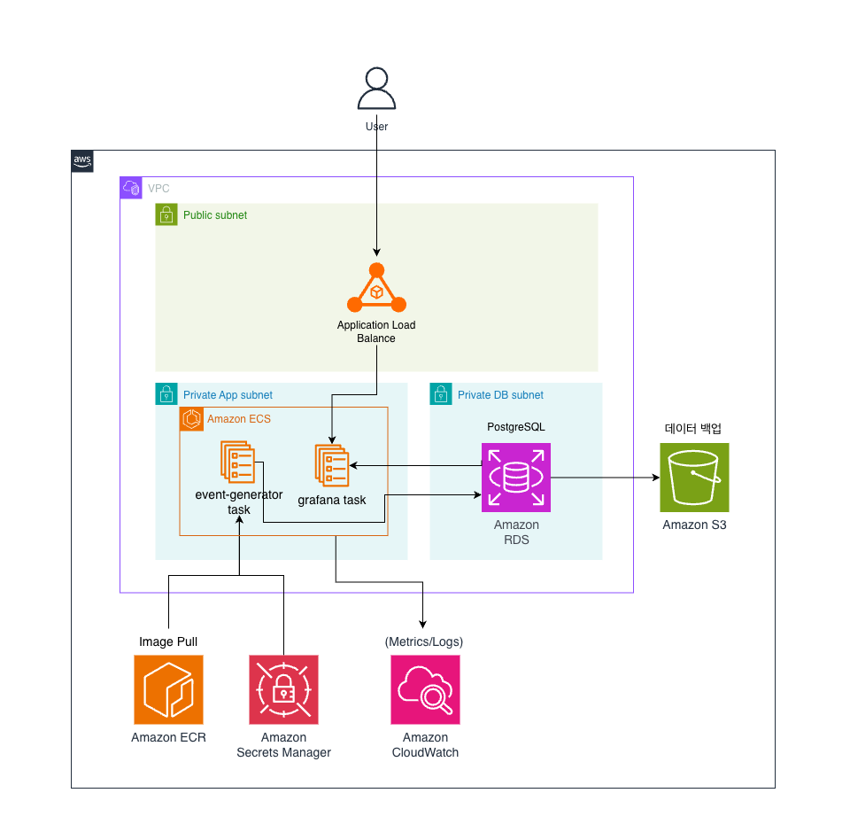

# liveklass-event-pipeline-assignment

웹 서비스에서 발생하는 가상 사용자 행동 이벤트를 생성하고, PostgreSQL에 저장한 뒤, Grafana로 시각화하는 간단한 이벤트 파이프라인입니다.

## 1. 실행 방법

### 필요한 도구
- Docker Desktop
- Python 3.11 이상

### 설치 및 실행
1. 전체 스택 실행
   ```bash
   docker compose up
   ```

2. PostgreSQL 확인
   ```bash
   docker compose exec db psql -U postgres -d assignment_db
   ```

3. Grafana 접속
- URL: `http://localhost:3000`
- ID: `admin`
- PW: `admin2026`


## 2. 스키마 설명

### events 테이블

| 컬럼명        | 타입           | 설명                                            |
| ---------- | ------------ | --------------------------------------------- |
| event_id   | BIGSERIAL    | 이벤트 고유 ID (PK)                                |
| user_id    | INTEGER      | 사용자 ID                                        |
| session_id | VARCHAR(100) | 세션 식별자                                        |
| event_type | VARCHAR(50)  | 이벤트 유형 (`view`, `enroll`, `payment`, `error`) |
| product_id | INTEGER      | 강의 ID                                         |
| price      | INTEGER      | 강의 가격                                         |
| event_time | TIMESTAMP    | 이벤트 발생 시각                                     |

온라인 강의 플랫폼의 사용자 행동 데이터를 가정하여 스키마를 설계했습니다. 

`events` 테이블은 이벤트 분석과 운영 모니터링에 필요한 핵심 필드만 포함하도록 단순하게 구성했습니다. `user_id`와 `session_id`를 통해 사용자 및 세션 단위 분석이 가능하며, `product_id`와 `price`를 통해 강의 탐색 및 결제 흐름을 확인할 수 있도록 설계했습니다.

또한 `event_type`과 `event_time`을 활용하여 이벤트 발생 현황, 에러 비율, 사용자 활동량 등 주요 운영 지표를 집계하고 Grafana 대시보드로 시각화할 수 있도록 구성했습니다.


## 3. 구현하면서 고민한 점

### Step 1. 이벤트 생성기

#### (1) 세션 기반 이벤트 흐름 설계
초기 구현에서는 이벤트 1건이 하나의 세션을 의미하는 구조로 데이터를 생성했습니다. 그러나 실제 온라인 서비스에서는 사용자가 하나의 세션 내에서 여러 행동을 연속적으로 수행하므로, 단일 이벤트만 반복 생성하는 방식은 실제 사용자 행동 패턴을 충분히 반영하지 못한다고 판단했습니다.

이를 개선하기 위해 세션 단위 이벤트 생성 방식을 적용했으며, 하나의 세션에서 view → enroll → payment와 같은 연속적인 행동 흐름이 발생하도록 구현했습니다. 이를 통해 세션 기반 지표를 활용한 모니터링이 가능하도록 구성했습니다.

#### (2) 이벤트 타입 선정
이벤트 타입은 온라인 강의 플랫폼 환경을 가정하여 설계했습니다. 강의 조회, 수강 신청, 결제와 같은 주요 사용자 행동을 반영하기 위해 view, enroll, payment 이벤트를 정의했으며, 운영 환경에서의 장애 상황을 모니터링하기 위해 error 이벤트를 추가했습니다.

과제의 목적이 데이터 분석보다는 데이터 파이프라인 구축 및 운영 모니터링에 있다고 판단하여, 복잡한 사용자 행동 이벤트를 다수 추가하기보다는 서비스 상태를 파악할 수 있는 핵심 이벤트 중심으로 구성했습니다.

#### (3) 데이터 품질 검증
각 강의 ID에 대해 강의명과 가격 정보를 고정값으로 관리하여 동일한 강의에 서로 다른 가격이 저장되는 문제를 방지했습니다. 또한 데이터 적재 전 검증 로직을 추가하여 필수 컬럼 누락, 잘못된 이벤트 타입 등 비정상 데이터가 데이터베이스에 저장되지 않도록 구성했습니다. 이를 통해 데이터 생성 단계부터 데이터 품질을 관리할 수 있도록 구현했습니다.

#### (4) 데이터베이스 재시도 및 자동 복구 로직
Docker 환경에서는 데이터베이스가 완전히 준비되기 전에 애플리케이션이 먼저 실행되거나, 운영 중 일시적인 연결 장애가 발생할 수 있기 때문에 데이터베이스 연결 시 Exponential Backoff 기반 재시도 로직을 적용했습니다. 연결 실패 시 일정 시간 대기 후 재접속을 시도하도록 구현했으며, 운영 중 연결이 유실된 경우 자동으로 데이터베이스 연결을 복구하도록 구성했습니다.

#### (5) 로그 관리
파이프라인 운영 상태를 확인할 수 있도록 주요 동작 과정에 대한 로그를 기록하도록 구성했습니다.

애플리케이션 기동, 데이터베이스 연결, 이벤트 적재 성공, 데이터 검증 실패, 예외 발생 및 복구 과정 등을 로그로 남기도록 구현했으며, 운영자가 파이프라인 상태를 추적할 수 있도록 했습니다.

### Step 2. 로그 저장

#### PostgreSQL을 선택한 이유
이벤트 데이터를 단순 저장하는 것보다, 저장된 데이터를 실시간으로 집계하고 모니터링하는 과정이 중요하다고 판단했습니다.

이를 위해 PostgreSQL을 이벤트 저장소로 선택했습니다. PostgreSQL은 SQL 기반 집계 기능을 제공하므로 이벤트 발생 건수, 에러 비율, 활성 사용자 수와 같은 운영 지표를 효율적으로 계산할 수 있습니다. 또한 Grafana와의 연동이 용이하여 저장된 데이터를 기반으로 실시간 대시보드를 구성할 수 있습니다. 이를 통해 이벤트 적재부터 집계, 시각화까지 하나의 흐름으로 구성할 수 있었습니다.

### Step 3. 데이터 집계 분석

전체 추이, 이벤트 타입별 분포, 유저별 총 이벤트 수처럼 바로 확인할 수 있는 쿼리를 중심으로 두고, 시간 버킷은 대시보드와 같은 기준으로 맞춰 분석 결과가 화면과 어긋나지 않도록 했습니다.

이 단계에서 가장 고민한 부분은 운영 모니터링 환경에서 "무엇을 먼저 보여줘야 장애나 이상 징후를 빠르게 감지할 수 있는가"였습니다. 그래서 지표를 비즈니스 확장 관점보다 운영 안정성 관점에 맞춰 우선순위를 정했습니다. 전체 이벤트 추이는 시스템 처리량 변화를 확인하는 기준값으로 두고, error 비율은 장애 조기 감지를 위한 핵심 지표로 잡았습니다. 또한 활성 사용자 수와 세션당 평균 이벤트 수를 함께 보면서 단순 트래픽 증가와 비정상 패턴을 구분할 수 있도록 구성했습니다.

분석 쿼리는 4. 데이터 집계 분석 쿼리에 정리해두었습니다.

### Step 4. Docker로 실행 가능하게 만들기

`docker compose up` 한 번으로 PostgreSQL, 이벤트 생성기, Grafana가 함께 실행되도록 구성했습니다.

`docker-compose.yml`에서는 `db`, `app`, `grafana` 3개 서비스를 명시적으로 분리하고, 실행 순서와 데이터 지속성을 고려해 설정했습니다. `db` 서비스는 `pg_isready` 기반 healthcheck를 사용하고, `app`/`grafana`는 `depends_on: condition: service_healthy`로 DB 준비 이후 기동되도록 구성해 초기 연결 실패를 줄였습니다.

또한 `./db/schema.sql`을 DB 초기화 경로에 매핑해 최초 기동 시 스키마가 자동 생성되도록 했고, `pgdata`/`grafana-data` named volume으로 DB와 Grafana 상태를 재시작 후에도 유지했습니다. 운영 확인을 위해 `app` 로그는 `./logs:/app/logs`로 로컬에 매핑했으며, 각 서비스에 `restart` 정책(`always`, `on-failure`, `unless-stopped`)을 분리 적용해 장애 상황에서 자동 복구되도록 구성했습니다.

### Step 5. 결과 시각화
비즈니스 인사이트를 더 풍부하게 보여주는 대시보드를 만들 수도 있었지만, 과제의 기본에 충실하기 위해 시스템 운영 이벤트를 확인하는 방향에 집중했습니다. 그래서 추가적인 컬럼 확장은 하지 않았고, Grafana도 운영 관점에서 집계할 만한 지표들 중심으로 구성했습니다. 대시보드는 전체 이벤트 흐름, error 비율, 활성 사용자, 세션 활동 같은 운영 지표가 바로 보이도록 배치했습니다.


## 4. 데이터 집계 분석 쿼리

### (1). 이벤트 타입별 발생 횟수

```sql
SELECT
    event_type,
    COUNT(*) AS event_count
FROM events
GROUP BY event_type
ORDER BY event_count DESC, event_type ASC;
```

이벤트 타입별 발생 건수를 집계하여 서비스 내 사용자 행동 분포를 확인합니다.

---

### (2) 유저별 총 이벤트 수

```sql
SELECT
    user_id,
    COUNT(*) AS event_count
FROM events
GROUP BY user_id
ORDER BY event_count DESC, user_id ASC
LIMIT 10;
```

이벤트 발생 횟수가 많은 상위 사용자를 조회하여 사용자 활동량을 확인합니다.

---

### (3) 시간대별 이벤트 추이

```sql
SELECT
    date_trunc('minute', event_time) AS time,
    COUNT(*) AS event_count
FROM events
GROUP BY 1
ORDER BY 1;
```

시간에 따른 전체 이벤트 발생량을 집계하여 서비스 트래픽 변화를 확인합니다.

※ Grafana에서는 10분 단위 그룹화(`$__timeGroupAlias`)를 적용하여 시각화했습니다.

---

### (4) 에러 이벤트 비율

```sql
SELECT
    ROUND(
        100.0 * COUNT(*) FILTER (WHERE event_type = 'error')
        / NULLIF(COUNT(*), 0),
        2
    ) AS error_ratio
FROM events;
```

전체 이벤트 대비 에러 이벤트의 비율을 계산하여 서비스 안정성을 모니터링합니다.

---

### (5) 활성 사용자 수

```sql
SELECT
    date_trunc('minute', event_time) AS time,
    COUNT(DISTINCT user_id) AS active_users
FROM events
GROUP BY 1
ORDER BY 1;
```

특정 시간 구간 동안 활동한 사용자 수를 집계하여 서비스 이용 현황을 확인합니다.

---

### (6) 평균 세션 활동 수

```sql
SELECT
    date_trunc('minute', event_time) AS time,
    ROUND(
        COUNT(*)::numeric
        / NULLIF(COUNT(DISTINCT session_id), 0),
        2
    ) AS avg_events_per_session
FROM events
GROUP BY 1
ORDER BY 1;
```

세션당 평균 이벤트 수를 계산하여 사용자의 평균 활동량을 확인합니다.


## 5. 시각화

Grafana 대시보드는 `docker compose up` 이후 `http://localhost:3000`에서 확인할 수 있습니다. 주요 패널은 다음과 같습니다.



- `Total Events` : 현재까지 적재된 전체 이벤트 수를 확인합니다.
- `Error Ratio` : 전체 이벤트 중 error 이벤트가 차지하는 비율을 확인합니다.
- `Event Type Distribution` : view, enroll, payment, error 이벤트가 어떤 비중으로 발생했는지 비교합니다.



- `Overall Event Trend` : 시간 흐름에 따른 전체 이벤트 발생 추이를 확인합니다.



- `Average Events per User` : 시간 구간별 사용자 1명당 평균 이벤트 수를 확인합니다.
- `Active Users` : 시간 구간별 이벤트를 발생시킨 고유 사용자 수를 확인합니다.



- `Average Session Activity` : 시간 구간별 세션 1개당 평균 이벤트 수를 확인합니다.
- `Top Users` : 이벤트를 가장 많이 발생시킨 상위 사용자를 확인합니다.


## 6. 선택 과제 A. Kubernetes 기초 이해

Step 1 이벤트 생성기 앱을 Kubernetes에 배포한다고 가정하고 `k8s/` 디렉터리에 아래 리소스 manifest를 작성했습니다.

- `k8s/deployment.yaml`
- `k8s/configmap.yaml`
- `k8s/secret.yaml`
- `k8s/pvc.yaml`
- `k8s/service.yaml`

### (1) 선택한 Kubernetes 리소스의 역할

- `Deployment` : 이벤트 생성기 Pod를 원하는 개수(현재 1개)로 유지하고, 장애로 Pod가 종료되면 자동으로 재생성합니다.

- `ConfigMap` : `DB_HOST`, `DB_NAME`, `DB_PORT`, `PYTHONUNBUFFERED` 같은 일반 설정값을 분리해 코드/이미지 변경 없이 환경별 설정을 바꿀 수 있게 합니다.

- `Secret` : `DB_USER`, `DB_PASSWORD` 같은 민감한 연결 정보를 설정과 분리해 관리합니다.

- `PersistentVolumeClaim` : `/app/logs` 경로를 영속 볼륨에 연결해 Pod가 재생성되어도 로그 파일이 유지되도록 합니다.

- `Service` : 클러스터 내부에서 이벤트 생성기 Pod를 고정된 이름으로 접근할 수 있게 하는 네트워크 진입점을 제공합니다.

### (2) Kubernetes 리소스를 선택한 이유

- 이벤트 생성기는 장시간 실행되며 예외 상황에서 자동 복구가 필요하므로 `Deployment`를 사용했습니다.
- 운영 환경에서는 설정값과 민감정보를 이미지에 고정하지 않는 것이 중요하므로 `ConfigMap`과 `Secret`을 분리했습니다.
- 본 프로젝트는 로그 기반 운영 모니터링을 포함하므로 컨테이너 재시작 후에도 로그를 보존하기 위해 `PVC`를 추가했습니다.
- 향후 내부 연계 서비스(배치, 모니터링, 관리자 도구 등)에서 안정적으로 접근할 수 있도록 `Service`를 함께 구성했습니다.


## 7. 선택 과제 B. AWS 기초 이해

### (1) AWS 아키텍처 설계 



- `Application Load Balancer` : Grafana 대시보드를 외부 브라우저에서 접근할 수 있도록 퍼블릭 진입점을 ALB로 구성했습니다. 외부 요청은 ALB를 통해서만 내부 서비스로 전달됩니다.

- `Amazon ECS (Private App Subnet)` : 이벤트 생성기와 Grafana 컨테이너를 private subnet에서 실행해 외부 직접 접근을 차단하고, 서비스 단위 배포와 장애 복구가 가능하도록 구성했습니다.

- `Amazon RDS for PostgreSQL (Private DB Subnet)` : 이벤트 데이터를 안정적으로 저장하고 SQL 집계를 수행하기 위해 선택했습니다. DB를 별도 private DB subnet에 분리해 애플리케이션 계층과 보안 경계를 분리했습니다.

- `Amazon ECR` : ECS에서 실행할 컨테이너 이미지를 버전 단위로 저장하고 동일 이미지를 안정적으로 배포하기 위해 사용합니다.

- `Amazon CloudWatch` : ECS 컨테이너 로그를 중앙 수집해 실행 상태와 오류 패턴을 운영 관점에서 모니터링하기 위해 사용합니다.

- `AWS Secrets Manager` : DB 계정 정보 같은 민감값을 코드/이미지와 분리해 안전하게 주입하기 위해 사용합니다.

- `Amazon S3` : RDS 데이터 덤프 파일을 장기 보관하는 백업 아카이브 저장소로 사용해 운영 백업과 별도의 복구 경로를 확보합니다.


### (2) 선택한 AWS 서비스의 역할 차이 설명

- `ECS`는 애플리케이션 실행 계층이고, `RDS`는 상태 데이터 저장 계층입니다. 즉, ECS는 컨테이너를 실행하고 RDS는 이벤트 데이터를 저장합니다.
- `RDS + Grafana`는 SQL 기반 집계/분석 시각화를 담당하고, `CloudWatch`는 애플리케이션 로그/운영 지표 모니터링을 담당합니다.
- `ECR`은 컨테이너 이미지 저장소, `Secrets Manager`는 민감 설정 저장소로 역할을 분리했습니다.
- `S3`는 서비스 실행 경로가 아닌 백업/아카이브 경로로 사용했습니다.
- 시스템 운영 이벤트 대시보드는 `Grafana`와 `CloudWatch`를 사용했습니다. SQL 집계가 필요한 분석은 `RDS + Grafana`, AWS 리소스 운영 모니터링은 `CloudWatch`로 분리해 구성했습니다.
- 보안과 운영 편의성을 함께 맞추기 위해 DB는 private DB subnet에 분리하고, 애플리케이션 설정은 `Secrets Manager`로 분리했습니다.

### (3) 설계한 아키텍처에서 가장 고민한 부분

- 초기에는 이벤트 데이터를 `S3`에 저장한 뒤 `AWS Glue`를 통해 메타데이터를 관리하고, `Athena`를 활용하여 SQL 기반 분석을 수행하는 S3 기반 데이터 레이크 구조를 구성하는 방안을 고려했습니다. 
하지만 본 과제의 목적이 대규모 데이터 분석보다는 이벤트 생성, 저장, 시각화 및 운영 모니터링 파이프라인 구현에 있다고 판단하여 데이터 레이크 계층을 추가하지 않고 PostgreSQL을 중심으로 이벤트 데이터를 저장하고 Grafana를 통해 운영 지표를 모니터링하는 구조를 선택했습니다. 
향후 사용자 행동 분석, 데이터 재처리 등의 요구사항이 추가된다면 `S3(Data Lake) + Glue + Athena` 구조를 도입하여 분석 플랫폼으로 확장하는 방향을 검토할 수 있을 것 같습니다.
